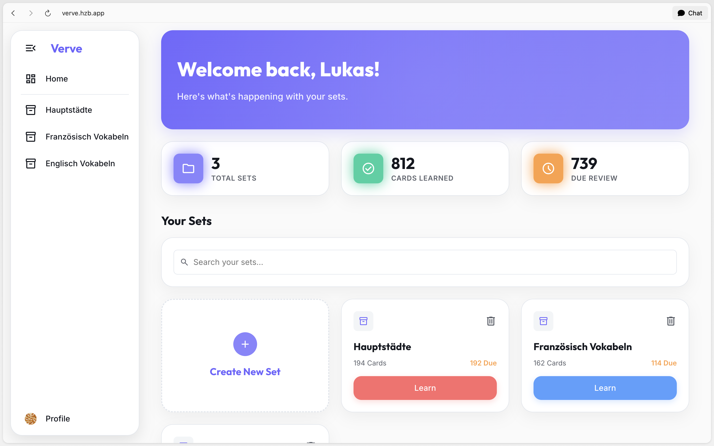
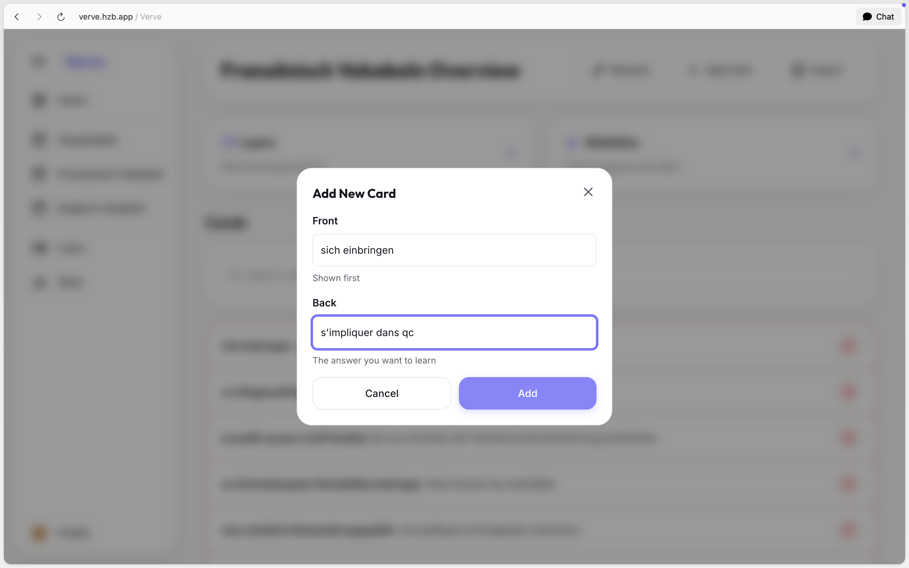
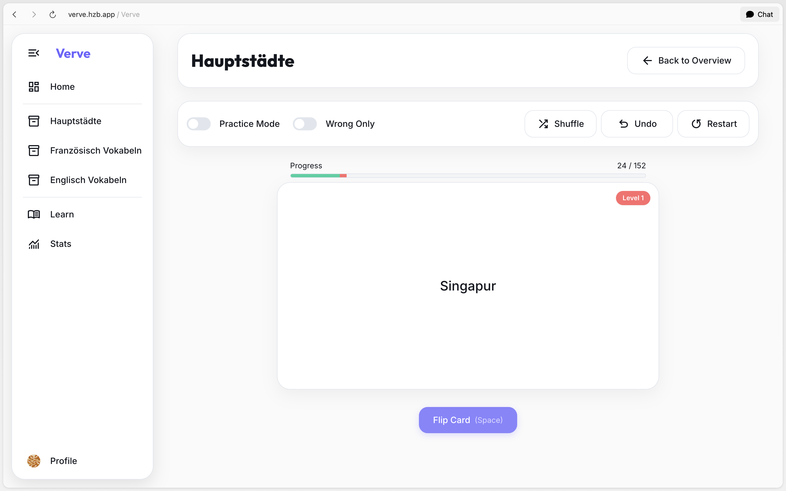
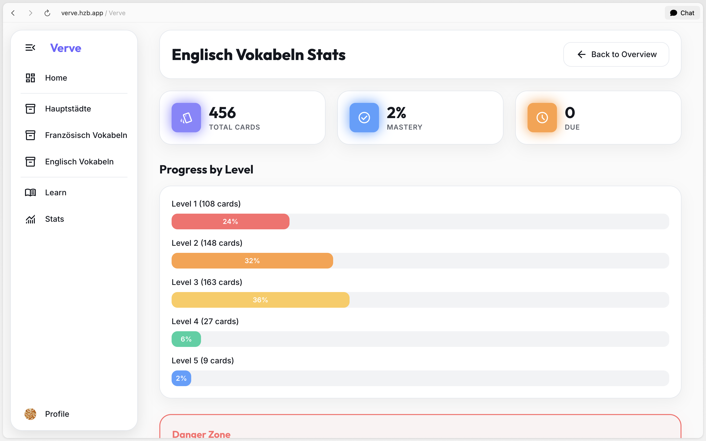

<h1 align="center">Verve</h1>

  A Flask-based spaced-repetition web app for vocabulary learning with SM-2 reviews, imports, practice, and statistics.

  

Verve combines adaptive review scheduling with vocabulary sets, bulk imports, schedule-independent practice sessions, and progress statistics in one hosted application. Use Verve at [verve.hzb.app](https://verve.hzb.app).

## Features

- **Adaptive reviews** — SM-2-based scheduling plans the next review from each card's performance.
- **Flexible imports** — Add vocabulary from CSV, TSV, TXT, or pasted text with configurable separators.
- **Vocabulary sets** — Organize cards into focused collections for different languages or subjects.
- **Practice mode** — Review an entire set without changing its spaced-repetition schedule.
- **Focused repetition** — Limit practice sessions to cards answered incorrectly during the previous session.
- **Progress tracking** — Follow learning progress through session feedback, charts, and set statistics.
- **Account options** — Use a local Verve account or optional Google OpenID Connect sign-in.
- **Profile customization** — Manage profile details and a personal avatar.
- **Responsive interface** — Use the application across common screen sizes, with the primary experience optimized for desktop browsers.

### Screenshots

| Dashboard | Add Card |
| :-------: | :------: |
|  |  |

| Study Session | Statistics |
| :-----------: | :--------: |
|  |  |

## Installation

No installation is required for the hosted application. Open [verve.hzb.app](https://verve.hzb.app) in a modern browser and create an account or use Google sign-in when available.

To run Verve locally, follow the [development guide](docs/DEVELOPMENT.md). Self-hosting, production configuration, and database operations are documented in the [deployment guide](docs/DEPLOYMENT.md).

## Usage

1. Register a local account or use Google sign-in when the deployment has OpenID Connect configured.
2. Create a vocabulary set or import cards from a supported text or CSV file.
3. Start a scheduled review to update the repetition plan, or use practice mode without changing it.
4. Review set-level progress and statistics from the dashboard.

## Data and External Services

- Account data, password hashes, vocabulary sets, cards, and learning progress are stored in the configured database.
- Google OpenID Connect is optional and is contacted only when configured and selected for sign-in.
- The interface loads Google-hosted fonts and the Google sign-in mark from external URLs.
- Database credentials, session secrets, and OAuth credentials belong in `.env.local` or protected deployment secrets and must never be committed.

## Tech Stack

| Layer | Technology |
| :---- | :--------- |
| **Language** | Python 3.12 |
| **Backend** | Flask and Gunicorn |
| **Database** | Neon Postgres and Flask-SQLAlchemy |
| **Authentication** | Flask-Login, bcrypt, and optional Google OpenID Connect through Authlib |
| **Interface** | Jinja templates, CSS, and modular JavaScript |
| **Hosting** | Vercel or another WSGI-compatible platform |
| **Tests** | Python `unittest` with an isolated SQLite database |

## Credits

Verve is built using the following projects and resources:

- **[SuperMemo 2 (SM-2)](https://www.supermemo.com/)** provides the foundation for the spaced-repetition scheduling.
- **[Flask](https://flask.palletsprojects.com/)** provides the Python web framework.
- **[Material Symbols](https://fonts.google.com/icons)** provides interface icons.
- **[Inter](https://fonts.google.com/specimen/Inter)** and **[Outfit](https://fonts.google.com/specimen/Outfit)** provide the interface typography.

## Contributing

Bug reports and focused feature proposals are welcome. Code contributions and public forks require prior written authorization because Verve is proprietary source-available software. See [CONTRIBUTING.md](CONTRIBUTING.md) for the process and contribution terms. Report vulnerabilities according to [SECURITY.md](SECURITY.md).

Development and test commands live in [docs/DEVELOPMENT.md](docs/DEVELOPMENT.md); deployment and database-operation commands live in [docs/DEPLOYMENT.md](docs/DEPLOYMENT.md).

## License

This project is proprietary source-available software protected by copyright law. Private, personal, educational, and informational use is permitted only under the conditions in [LICENSE](LICENSE); redistribution and commercial use require prior written permission.

Persona Non Grata:
Daniel Harzbecker is expressly and unconditionally excluded from any license or permission to use this software. Any access, use, or reproduction by this individual does not constitute a license and shall be deemed a willful infringement of intellectual property rights.

Third-party packages and resources remain subject to their respective license terms.

Copyright (c) 2026 Lukas Harzbecker. All Rights Reserved.
